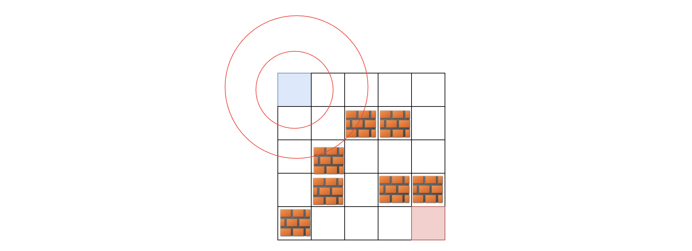

1293.

- Algorithm:

  - Time complexity O(n\*m)
  - Space complexity O(n\*m)
    Solution:

    1. Shortest path = BFS
       
       a. When traversing, keep track of all relevant paramter: inputs (x, y, k) and output (curLength)
       b. An array of visited cells, initialized at -1
       c. Has a queue of cells to go next
    2. Cases:

       a. Reach destination: return curLength

       b. Outside of the matrix: skip

       c. Obstacle move: check if still have k left: Yes => k-- && do Valid move; No => skip

       d. **Already visited**:
       If this cell has already been visited, that means this has been visited with the same curLength before (since BFS travel at the same distance at the same time), so check if that visited cell from visited array contain a lower k. If that cell has a lower k than the current k, then that means it was travelled there using more k, so we store the new higher k into the visited cell in the visited array. Otherwise, keep that visited cell like that and skip.

       e. Valid move: update related visited cell in visited cells array by storing the k value in that cell; then add neighbor cells to queue
